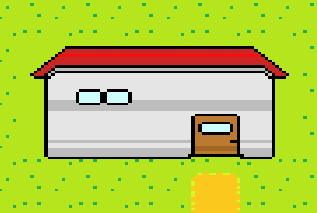
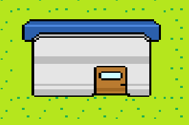
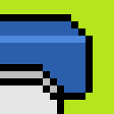
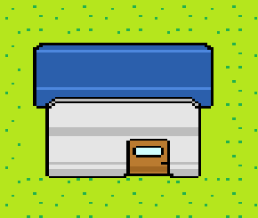
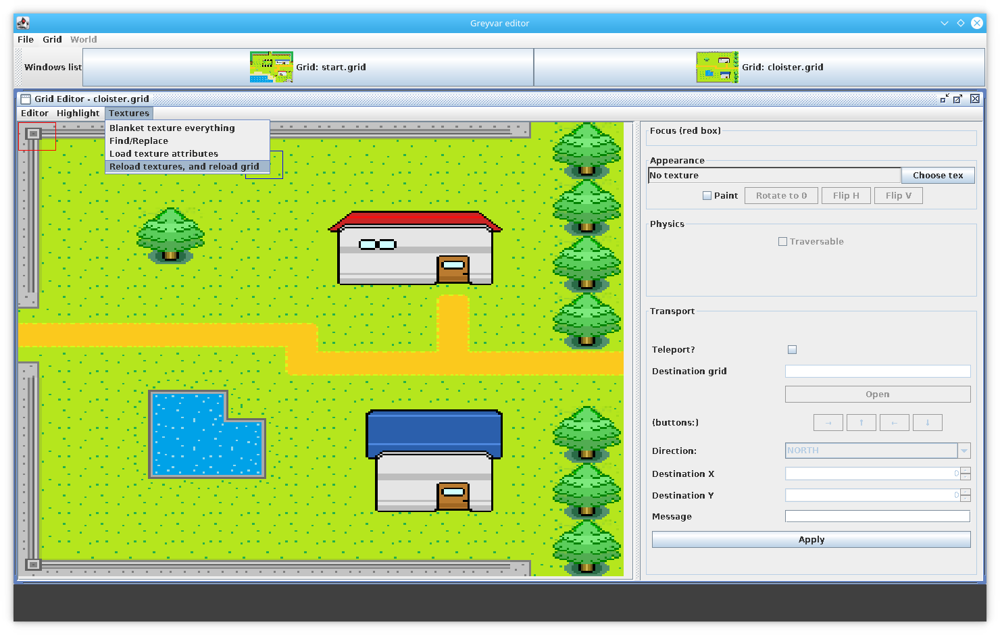

# Greyvar 20th April 2018 - Building 8-bit houses

I thought I'd make a few short blog posts on some of simple things in making Greyvar. So, starting off on on the last thing I worked on this week - roofs for houses. Not the most exciting thing you might think - but let me tell you all about it!

Here's what a house looks like currently in Greyvar: 

Okay, for sure it's basic. I'm no artist, and I just threw something together a while ago.

It doesn't look right. It's kind of flat. It just looks painted on the grass, buildings have depth. It doesn't take up the space it should on the map.

As I said, I'm not artist, so I went to take a look at two art styles from games I've really enjoyed from my childhood; [Zelda - A Link to the Past](https://www.zeldadungeon.net/a-link-to-the-past-walkthrough/), and the [Gameboy Pokemon Games](https://en.wikipedia.org/wiki/Pokémon_FireRed_and_LeafGreen), specifically the FireRed version, which is both color, and has a similar resolution of Greyvar.

But here's a real problem; I'm not an artist, but I don't want to plagiarize from these games! I can't just copy and paste basically from these games - it's important that Greyvar has it's own, original art style.

One of the first things to tackle were those horrible angular parts of the roof. Lets try with curved edges to the roof:

This is going to take some time to get right, and at this stage of Greyvar's development I'm still honestly not sure what that will look like. There are a few options, a true top-down perspective, as used in games like Zelda 2. There is a 45-degrees perspective, as used in Pokemon, with it's slanted houses.

All the "tiles" that make up the map in Greyvar at the moment are 16x16 pixels. Looking back at the houses, the current roof is made up of a 2x different 16x16 pixel blocks, and the corner tiles look like this:

But this has the affect of the roof looking pretty flat still. Looking back at our inspiration, Zelda, and Pokemon, they have houses with much larger roofs. This is important, because even in 8 bit, it helps the player with a consistent perspective. This probably won't be how roofs look like in the final version of the game, but lets try that: 

Okay, we're certainly getting somewhere. It doesn't look great, but it's an improvement on what we had - the building now has some depth. The problem with iterating on this further at this stage is that the change from thin-roofs to thick roofs required 6 textures now instead of 2!

* Bottom corner
* Bottom middle
* Side
* Middle
* Top corner
* Top 

Actually, it took quite a while drawing these textures, getting parts to line up, even if these are simple graphics on a 16x16 tile. 

In order to make this process go a little quicker, it actually made sense to allow for textures to be reloaded in the map editor. This allowed me to make edits in the graphics program (Gimp), and see them in the map editor on a fully rendered house with just one button click. Here's a sneak-preview of what the map editor looks like:

As you can see from the menu, textures can be easily reloaded now.

Hopefully these edits will allow for faster progression when updating Greyvar's art style in the future!

Other things that have taken time this week are mostly around input handling - you would not believe how much goes into just getting keyboard and controller input into the game with a stable frame rate! That is something that we'll talk about a lot more in future blog posts though :)! 

If you enjoyed this blog post, please comment back on Facebook/Discord, etc. 
