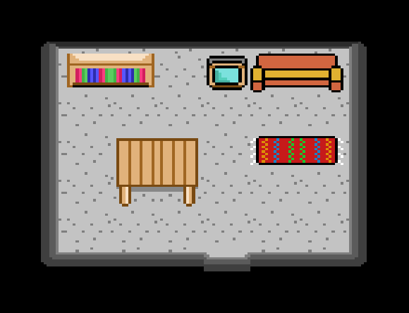
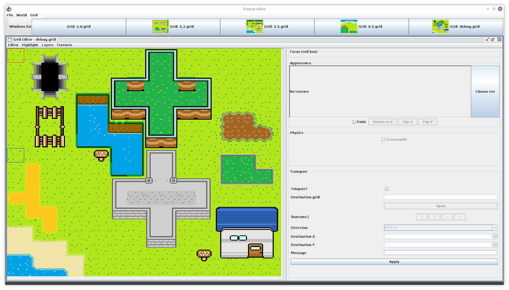
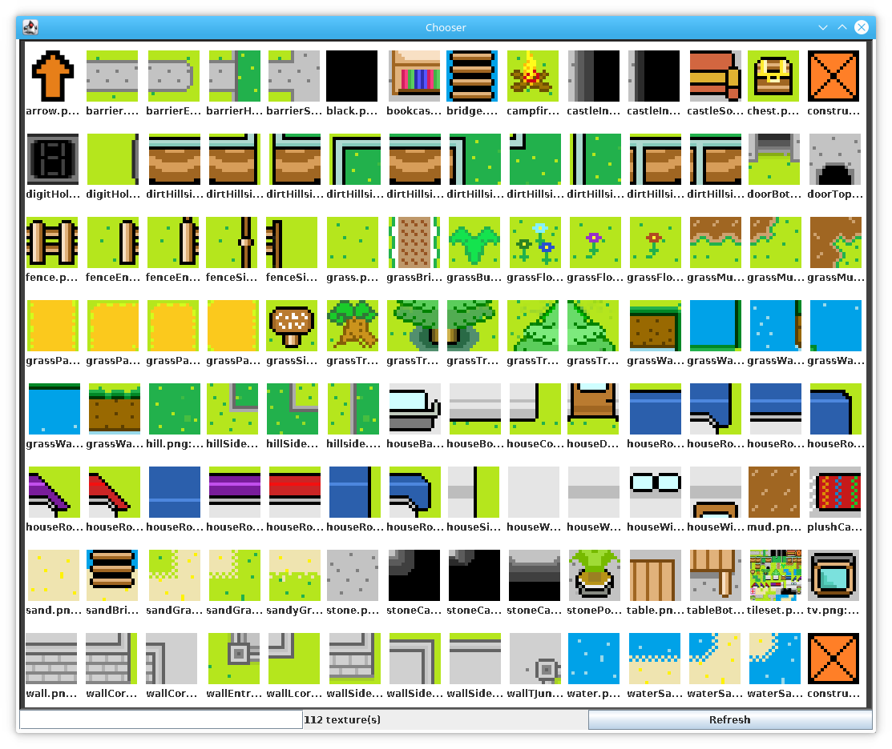

# Greyvar 25th May 2018 - The Map Editor

So it's been just over a month since my last update, and what a month! I've spent a bunch of time travelling, busy with work, and various other stuff. But it's been great fun to squeeze in some time for Greyvar in the evenings when I can. I even set about creating a couple of new textures on a plane, just to sqeeze so time in, working mostly on some indoor assets; 

But I wanted to take most of the time in this update to talk about the **map editor**. Funnily enough, the map editor is something I started years and years ago, when I just wanted to have a fiddle with tile-based map editing. It grew and grew, and is largely became a reason for me making Greyvar in the first place.

Here's what the map editor looks like today, showing one of the debug maps I use to check for texture alignment, and trying to get the right perspective on textures too;

As you can see, it's a desktop based Java application. You can create individual maps ("grids") in it, and I recently added support for "worlds" - which are many grids connected to each other. 

Making these grids is point and click, selecting textures from the texture viewer (below), and painting them much like you would do with pixel art.

The editor is pretty functional today for making grids, but where it needs to go in the future is;

* Support for multiple "layers" - at the moment it can paint the background, but it should have support for;
  1. Background Layer
  2. Entity Layer (enemies, players, pickups, etc)
  3. Fluid Layer (water, lava, slime, etc)
* Writing grids as Yaml files. At the moment the grids are CSV files. It was OK to start off with, but really I need a file format with more structure today.
* Support for editing other areas of the game - rules, triggers, that sort of thing.

Over the next month or so, I'll continue to work on Yaml save support for the maps, and then Yaml loading on the server side (eugh, all the fun stuff!). Once that is done, it's back to Multiplayer support and some polish on the input handling side. Then we can start working on basic game mechanics - that's the fun stuff!
