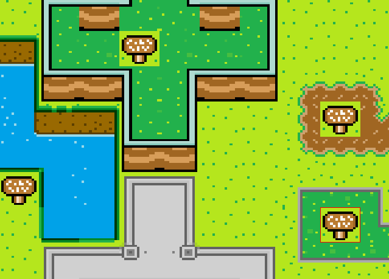
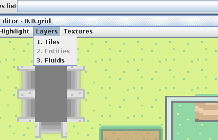
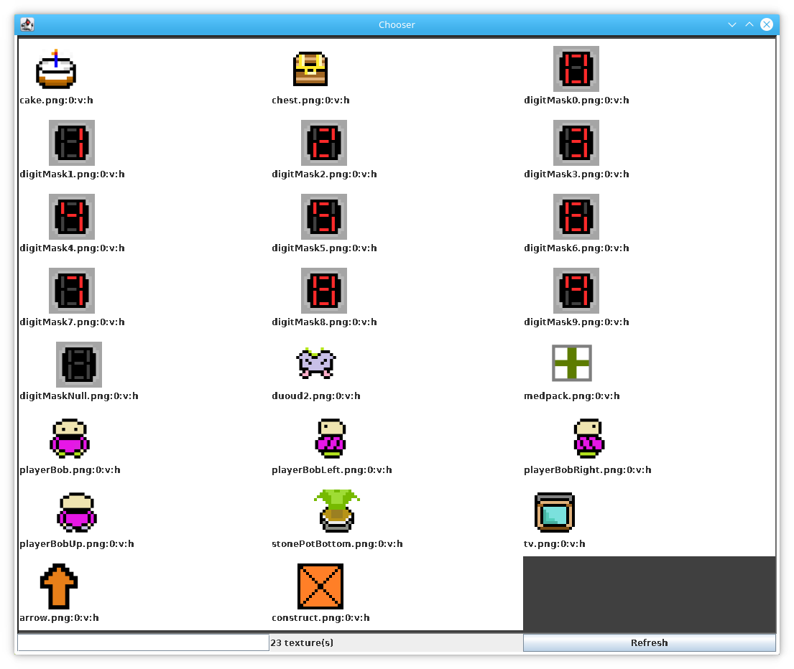
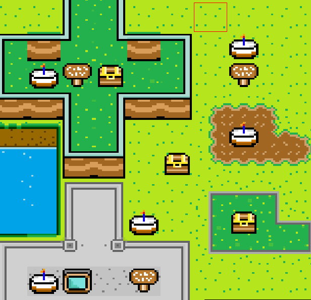

# Greyvar 31st May - Entity layer in the map editor

<iframe width="560" height="315" src="https://www.youtube.com/embed/SYt4anehZyU" frameborder="0" allow="autoplay; encrypted-media" allowfullscreen></iframe>

Entities are things that the player can interact with; chests, signs, TV's (!), buttons, pressure pads and that sort of thing. I just added support for these in the map editor and wanted to tell you a bit more about it!

Up until now, the screenshots you've seen have had what look like entities, but they're actually just flat tiles - part of the background layer. I cheated by drawing a sign with a grass texture in the background, for example. I found this useful to get something that looked visually convincing for the time being, but now I needed to fix it. 
The problem was that if I wanted to re-use a sign, and put it on darker grass, on a castle, or somewhere else, I'd end up with it still having the background texture it was drawn with, so it would look like this; 

Well that looks no good. Okay, a simple way around this would be to re-draw the sign onto multiple different backgrounds, creating multiple different textures. This is simple, but it's very time consuming. I want to save myself some time!

Looking at the menu now, you can see support for layers here - including fluids (that doesn't do anything yet). Switching to the entity layer will "grey out" the background, so that I know I'm in entity mode;

Then, using the new entity panel on the sidebar, can select entities in much the same way as textures;

Finally, lets paint those entities onto many backgrounds - signs, chests and cake for everyone!

This is of course just a simple feature that is in nearly all games. I just wanted to show you my implementation, because I managed to code it up and get it working nicely in just one evening. This required some pretty big changes in the map editor actually, including storing multiple texture caches, and messing a around with the UI. While it felt like a bit of a disruptive change (I almost gave up half way through), it now will save me a whole bunch of time in the long run. When developing indie games, long term time saving is everything.
