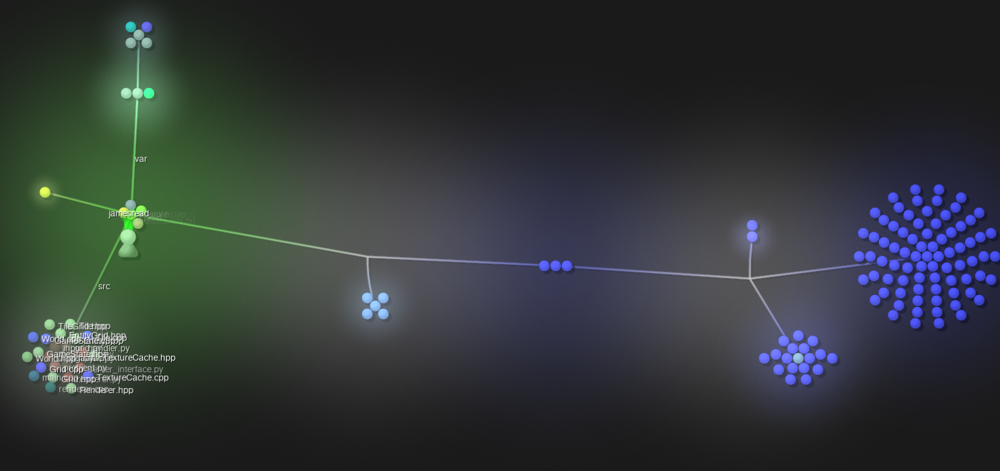

# Visualization of recent changes - 25th June 2018

<iframe width="560" height="315" src="https://www.youtube.com/embed/AEKZ7v2lL0Y" frameborder="0" allow="autoplay; encrypted-media" allowfullscreen></iframe>

Over the last month or so I've been working on Greyvar a whole bunch, on many things from the network code, to the graphical user inteface, the input system, the map editor, entity support, and much more. However, None of these systems are really in a position that I can write a single blog post about them. Therefore, let me post a quick update that visualizes the source code changes recently.

Each little circle is a file that makes up Greyvar, and if you see the video, you can get an idea of the rate of change in the code base.

I produced this visualisation with Gource, wich is free software if you want to run it against your code base too.

http://gource.io

