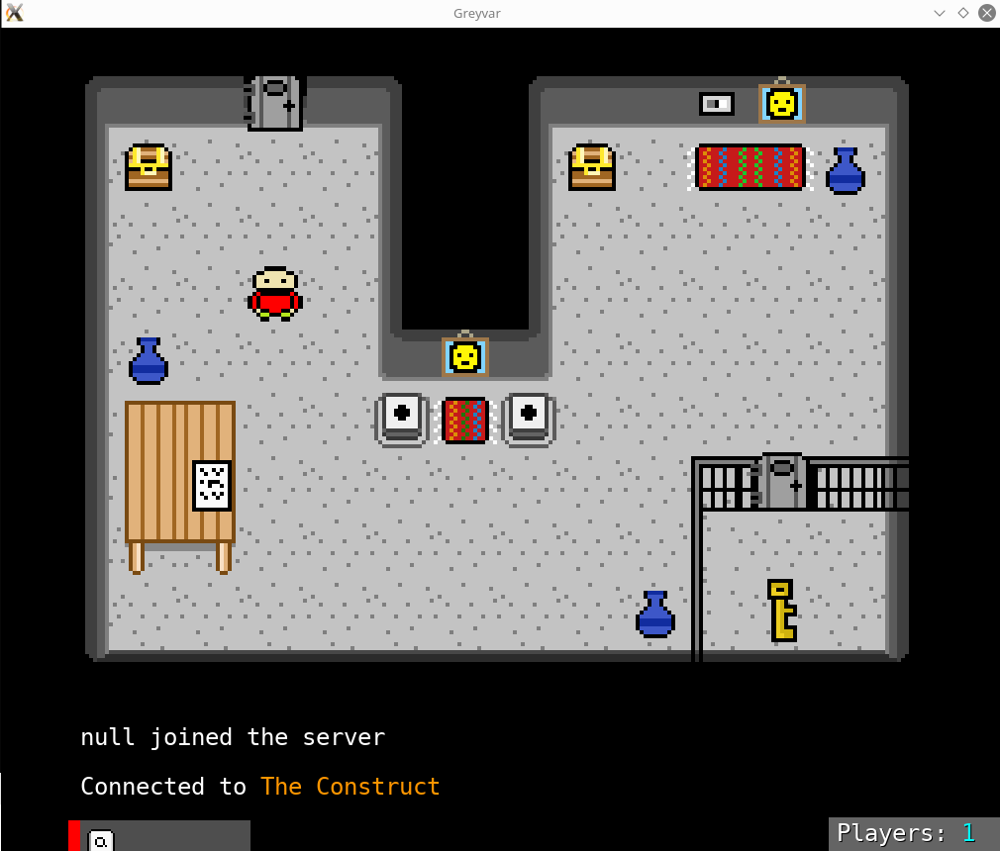

# Quick update - Cell of Escape

Over the last few updates on this blog, I've mainly been talking about the technical parts of implementing Greyvar. Code, map editors, that sort of thing. I wanted show a little bit of what the gameplay might look like.

This screenshot below shows what I *hope* will be the first concept map. I've got 4 maps at the moment - one was a large island that was far too ambitious to start off with (shown in quite a few screenshots already). One of those is a debug map (see last blog post). Anyway, the map below contains enough of the basic Greyvar concepts to test gameplay. 

There are buttons which (will soon) fire off triggers, there are animated paintings... (!), there are chests, keys, and, well, hopefully you can make out the rest!
